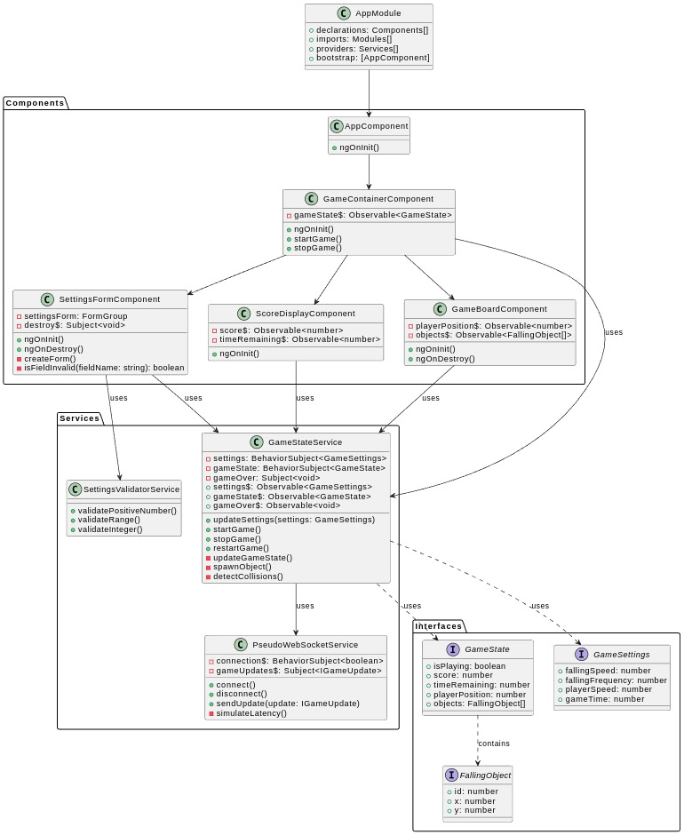

# Slots Game

A simple browser-based mini-game built with Angular where players control a character to catch falling objects. The game features configurable settings, real-time score tracking, and simulated WebSocket updates.



## Features

- Real-time gameplay with keyboard controls
- Configurable game settings:
  - Falling speed of objects
  - Frequency of object spawning
  - Player movement speed
  - Game duration
- Live score tracking
- Pseudo-WebSocket implementation for game state updates
- Responsive design with TailwindCSS

## Prerequisites

- Node.js (v18 or higher)
- Yarn package manager

## Installation

1. Clone the repository:

```bash
git clone https://github.com/lehcode/simple-slots.git
cd slots-game
```

1. Install dependencies:

```bash
yarn install
```

## Running the Application

1. Start the development server:

```bash
yarn start
```

2. Open your browser and navigate to `http://localhost:4200`

## Game Instructions

1. Configure game settings in the Settings page:
   - Falling Speed (10-50): Controls how fast objects fall
   - Falling Frequency (10-50): Controls how often new objects appear
   - Player Speed (10-50): Controls how fast the player can move
   - Game Time (10-50): Sets the game duration in seconds

2. Start the game:
   - Use left and right arrow keys to move the player
   - Catch falling objects to score points
   - Game ends when the timer runs out

## Technical Implementation

### Key Components

- **GameStateService**: Manages the core game logic and state
- **PseudoWebSocketService**: Simulates WebSocket connection for state updates
- **SettingsFormComponent**: Handles game configuration using reactive forms
- **GameComponent**: Main game UI and player controls

### Technologies Used

- Angular 18
- RxJS for reactive programming
- TailwindCSS for styling
- TypeScript for type safety

### Performance Optimizations

1. OnPush change detection strategy
2. Reactive forms for efficient form handling
3. RxJS operators for optimized data flow
4. Signal-based state management
5. RequestAnimationFrame for smooth animations

## Development Notes

- Uses strict TypeScript compilation
- Implements reactive programming patterns
- Follows Angular best practices and style guide
- Includes comprehensive type definitions
- Uses signals for efficient state management

## Building for Production

```bash
yarn build
```

The build artifacts will be stored in the `dist/` directory.

## Running Tests

```bash
yarn test
```

## License

This project is licensed under the MIT License - see the LICENSE file for details
